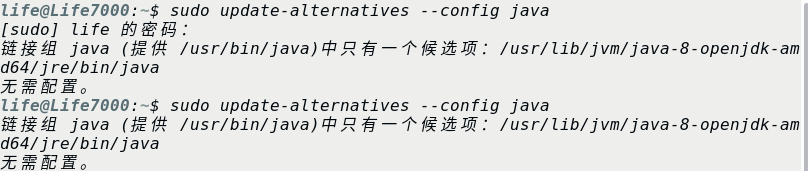
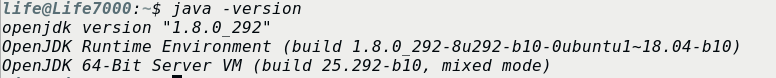
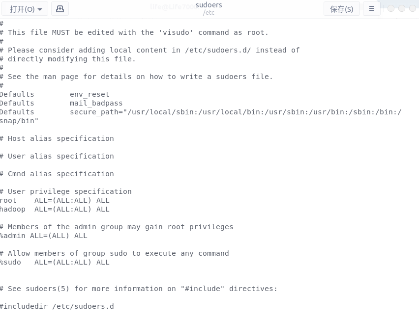
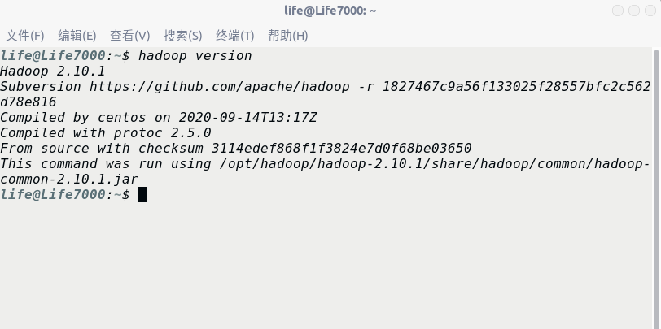
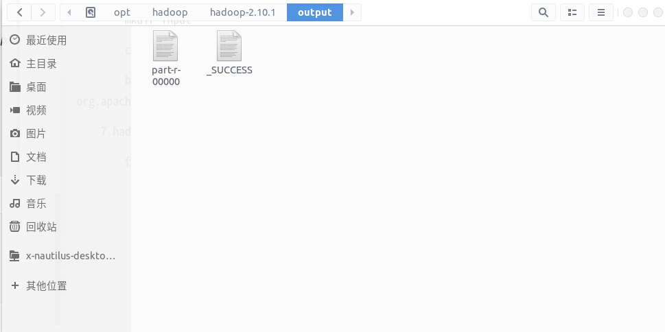

## Ubuntu环境下安装Hadoop及其环境的配置

### 1. 安装JAVA OpenJDK8

##### 1.1. 使用ctrl+alt+t打开终端，更新系统安装包缓存，并安装OpenJDK8:

```shell
$ sudo aot-get update
$sudo apt-get install openjdk-8-jdk
```

##### 1.2. 如果系统中存在多个版本的JDK，可以使用以下命令设置一个默认的JDK:

```shell
$ sudo update-alternatives --config java
$ sudo update-alternatives --config javac
```



##### 1.3. 查看系统安装的的java版本

```shell
$ java -version
```



### 2. 配置SSH及免密登录方式

##### 2.1. hadoop需要使用SSH的方式登录，Linux下需要安装SSH.在此只需要安装服务端就可以了：

```shell
$ sudo apt-get install openssh-server
```

如果要测试本机的登录，使用`$ ssh localhost`，然后输入'yes'就可以了，但如果换做是集群，工作量还是很大的，所以需要配置免密登录方式。

##### 2.2. 在本机生成公钥和私钥，输入指令：

```shell
$ ssh-keygen -t rsa
```

会在 ~/.ssh 文件夹下生成两个文件，在路径输入时，将文件名设置为**hadoop_rsa**，然后还会生成 另一个　**hadoop_rsa.pub** ，分别为私钥和公钥文件。

##### 2.3. 导入公钥到认证文件，并更改权限：

1) 导入本机：

```shell
$ cat ~/.ssh/hadoop_rsa.pub >> ~/.ssh/authorized_keys
```

2) 导入服务器(xxx表示当前主机的用户名)：

​	首先将公钥复制到服务器：

```shell
$ scp ~/.ssh/hadoop_rsa.pub xxx@localhost:/home/xxx/.ssh/hadoop_rsa.pub
```

​	然后将公钥导入到认证文件当中，这一步操作在服务器上进行:

```shell
$ ssh localhost
$ cst ~/hadoop_rsa.pub >> ~/.ssh/authorized_keys
```

​	最后在服务器上修改权限:

```shell
$ chmod 700 ~/.ssh
$ chmod 600 ~/.ssh
```

3) 测试：`$ ssh localhost`　第一次输入yes,之后就不需要了。

### ３.Hadoop的安装

##### 3.1. 在[hadoop官网](http://hadoop.apache.org/releases.html)，下载hadoop安装包，在这里我是用的是hadoop-2.10.1，选择binary下载即可。

##### 3.2. 将下载的文件解压，然后移动到目的文件夹：

```shell
$ tar -zvxf hadoop-2.10.1.tar.gz
$ mv ./hadoop-2.10.1 /opt/hadoop
```

##### 3.3. 创建hadoop用户和组，并授予执行权限:

```shell
$ sudo addgroup hadoop
$ sudo usermod -a -G hadoop xxx
```

接下来需要将hadoop组加入到sudoers当中，这里需要[赋予当前用户对etc/sudoers文件的写权限](#souders) 。授予写权限之后，使用指令打开文件进行编辑。

```shell
$ sudo gedit /etc/sudoers
```



在文件中　**root	ALL=(ALL:ALL)	ALL**　之后添加　**hadoop	ALL=(ALL:ALL)	ALL**　内容，保存并退出。

然后在shell中输入指令：

```shell
$ sudo chmod -R 755 /opt/hadoop
$ sudo chmod -R xxx:hadoop /opt/hadoop
```

##### 3.4. 修改配置文件，可以选择修改文件 /etc/profile

```shell
$ sudo gedit /etc/profile
```

在文件末尾添加如下的信息（这里的　HADOOP_HOME　和　JAVA_HOME　取决于自己系统上安装的文件位置，JAVA_HOME及在上文安装jdk时，jdk文件安装的位置)

```
export JAVA_HOME=/usr/lib/jvm/java-1.8.0-openjdk-amd64
export HADOOP_HOME=/opt/hadoop/hadoop-2.10.1
export PATH=.:${JAVA_HOME}/bin:${HADOOP_HOME}/bin:$PATH
```

保存后退出，并在shell中输入下面指令，是的配置文件可以立即生效

```shell
source /etc/hadoop
```

##### 3.5 测试是否配置成功

```shell
hadoop version
```



##### 3.6. hadoop单击配置(非分布式模式)，通过测试demo(一个文字统计部分)来检查配置是否正确

```shell
cd /opt/hadoop/hadoop-2.10.1
mkdir input
cp README.text input
bin/hadoop jar share/hadoop/mapreduce/sources/hadoop-mapreduce-examples-2.7.3-sources.jar org.apache.hadoop.examples.WordCount input output
```



##### 3.7. hadoop伪分布式配置

伪分布式配置只需要修改core-site.xml 和 hdfs-site.xml 两个文件就足够了，这两个文件都在 hadoop-2.10.1/etc/hadoop 文件夹中。

首先是core-site.xml,这是为了设置临时目录位置，否则会默认在/tmp/hadoo-hadoop中，这个文件夹在重启时可能会被系统清除，所以需要改变配置路径:

```html
<configuration>
        <property>
             <name>hadoop.tmp.dir</name>
             <value>file:/opt/hadoop/tmp</value>
             <description>Abase for other temporary directories.</description>
        </property>
        <property>
             <name>fs.defaultFS</name>
             <value>hdfs://localhost:9000</value>
        </property>
</configuration>
```

然后是hdfs-site.xml文件，伪分布式只有一个节点，所以必须配置成１，还配置了datanode和namenode的节点位置。

```html
<configuration>
        <property>
             <name>dfs.replication</name>
             <value>1</value>
        </property>
        <property>
             <name>dfs.namenode.name.dir</name>
             <value>file:/opt/hadoop/tmp/dfs/name</value>
        </property>
        <property>
             <name>dfs.datanode.data.dir</name>
             <value>file:/opt/hadoop/tmp/dfs/data</value>
        </property>
</configuration>
```


### souders {#souders}

1. 重启系统，在启动时按住F12，进入系统选择界面。

2. 因为我装的双系统，所以会出现Ubuntu和Windows两个选项，这里选择Ubuntu，进入Ubuntu系统的选项界面。

3. 然后进入当前界面的**"高级选项"**部分，找到**"Ubuntu (Recover Mode)"**,选择该项，回车进入恢复模式。

4. 进入恢复模式之后，会有如下的选项：

   * resume
   * clean
   * dokg
   * fsck
   * grub
   * netroot
   * root
   * xifx

5. 选择root，进入试用root用户进行系统回复，可以执行超级用户权限的操作。

6. 回车之后，可以在显示屏底部看到如下的命令提示符了

     ``root@TUZKI:~#``

7. 然后赋予对/etc/sudoers文件的写权限

   `chmod u+w /etc/sudoers`

8. 然后退出恢复模式，重启进入Ubuntu系统。

[sudoers]: 