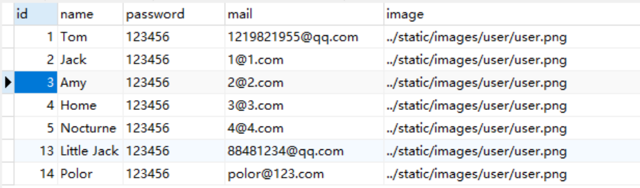
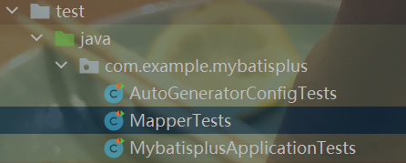
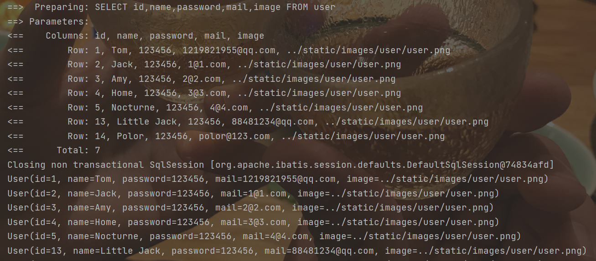
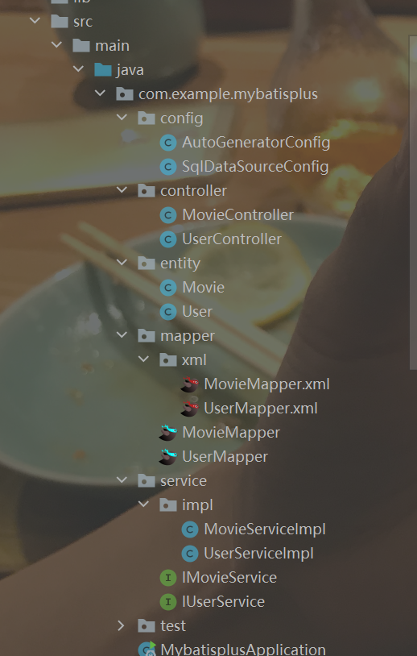
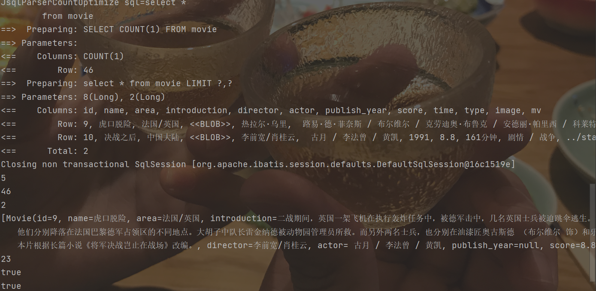
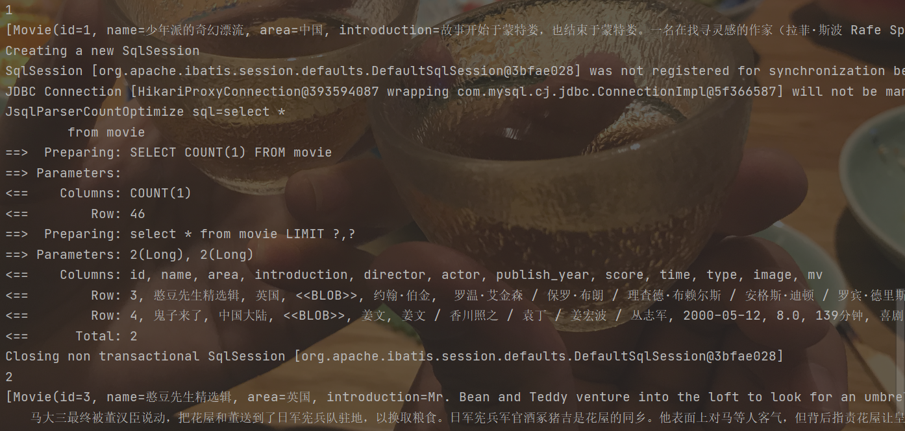

# MyBatis-Plus

内容总览：

* [简单测试](#简单测试)

* [代码自动生成器](#代码自动生成器（旧版本）)

* [自定义sql语句](#自定义sql语句)

* [查询分页](#查询分页)

  

## 简单测试

使用的数据库表：


内容信息：



##### 1、在pom.xml中添加相关配置

```xml
<dependency>
    <groupId>com.baomidou</groupId>
    <artifactId>mybatis-plus-boot-starter</artifactId>
    <version>3.3.1.tmp</version>
</dependency>
```

为了方便测试，因此在pom.xml文件中添加测试所需要的依赖

```xml
<dependency>
    <groupId>org.springframework.boot</groupId>
    <artifactId>spring-boot-test</artifactId>
</dependency>
```

##### 2、在application.yml中添加配置

```yml
# 用于显示执行的sql语句
mybatis-plus:
  configuration:
    log-impl: org.apache.ibatis.logging.stdout.StdOutImpl
```

##### 3、创建数据库表对应的entity和mapper文件

User类：在创建该User类使用了lombok组件，可以简化类的编写。

​		@Data提供了getter和setter

​		@AllArgsConstructor提供全参构造函数

​		@NoArgsConstructor提供无参构造函数

```java
@Data
@AllArgsConstructor
@NoArgsConstructor
public class User {
    Integer id;
    String name;
    String password;
    String mail;
    String image;

}
```

Mapper类：直接继承BaseMapper<T>其中实现了对数据库的基本的增删改查

```java
public interface UserMapper extends BaseMapper<User> {
}
```

##### 4、在启动类上添加Mapper文件的检索注解@MapperScan

```java
@SpringBootApplication
@MapperScan("com.example.mybatisplus.mapper")
public class MybatisplusApplication {

    public static void main(String[] args) {
        SpringApplication.run(MybatisplusApplication.class, args);
    }

}
```

##### 5、测试

在项目文件的test文件夹中创建MapperTests测试类



```java
@SpringBootTest
public class MapperTests {

    @Autowired
    UserMapper userMapper;

    @Test
    public void selectListTest(){
        List<User> userList = userMapper.selectList(null);
        userList.forEach(System.out::println);
    }
}
```

##### 6、执行结果



## 代码自动生成器（旧版本）

##### 1、在pom.xml文件中添加相应依赖（同时也要有mybatis-plus-boot-starter依赖）

```xml
<dependency>
    <groupId>com.baomidou</groupId>
    <artifactId>mybatis-plus-generator</artifactId>
    <version>3.3.1.tmp</version>
</dependency>
```

在使用MyBatis-Plus中的代码自动生成器时，需要模板引擎，它支持Velocity(默认)、Freemaker、Beetl，

```xml
<!-- https://mvnrepository.com/artifact/org.apache.velocity/velocity-engine-core -->
<dependency>
    <groupId>org.apache.velocity</groupId>
    <artifactId>velocity-engine-core</artifactId>
    <version>2.2</version>
</dependency>

<!-- https://mvnrepository.com/artifact/org.freemarker/freemarker -->
<dependency>
    <groupId>org.freemarker</groupId>
    <artifactId>freemarker</artifactId>
    <version>2.3.30</version>
</dependency>

<!-- https://mvnrepository.com/artifact/com.ibeetl/beetl -->
<dependency>
    <groupId>com.ibeetl</groupId>
    <artifactId>beetl</artifactId>
    <version>3.1.3.RELEASE</version>
</dependency>
```

如果选择了非默认引擎，需要在AutoGenerator中配置相关引擎：

```java
AutoGenerator generator = new AutoGenerator();

// set freemarker engine
generator.setTemplateEngine(new FreemarkerTemplateEngine());

// set beetl engine
generator.setTemplateEngine(new BeetlTemplateEngine());

// set custom engine (reference class is your custom engine class)
generator.setTemplateEngine(new CustomTemplateEngine());

// other config
...
```

在此我选择使用Velocity默认模板引擎，所以在pom.xml文件中添加如下依赖：

```xml
<dependency>
    <groupId>org.apache.velocity</groupId>
    <artifactId>velocity-engine-core</artifactId>
    <version>2.3</version>
</dependency>
```

###### <span style="color:red">踩坑：</span> 

​        在添加依赖时，并没有在pom.xml文件中配置org.apache.common:commons-lang3:3.10，但他报错显示没有找到该依赖，我从该网站[commons-lang3](http://maven.icm.edu.pl/artifactory/repo/org/apache/commons/commons-lang3/3.10/)下载commons-lang3.jar、commons-lang3-resources.jar、commons-lang3-javadoc.jar文件，然后拷贝到本地maven库当中就可以了

##### 2、编辑数据库信息读取类

```java
@Data
@Configuration
public class SqlDataSourceConfig {

    @Value("${spring.datasource.url}")
    private String url;

    @Value("${spring.datasource.username}")
    private String userName;

    @Value("${spring.datasource.password}")
    private String password;

    @Value("${spring.datasource.driver-class-name}")
    private String driver;

}
```

编写该类是为了方便获取application.yml文件中的数据库连接配置信息

##### 3、编写测试类

在test文件夹下创建AutoGeneratorConfigTests类

```java
@SpringBootTest
class AutoGeneratorConfigTests {

    @Autowired
    //注入数据库配置信息类
    private SqlDataSourceConfig sqlDataSourceConfig;

    @Test
    public void autoGeneratorTest(){
        //1、创建代码生成器
        AutoGenerator mpg = new AutoGenerator();

        //2、全局配置
        GlobalConfig gc = new GlobalConfig();
        //获取项目路径
        String projectPath = System.getProperty("user.dir");
        //设置文件输出路径
        gc.setOutputDir(projectPath+"/src/main/java");
        //设置作者
        gc.setAuthor("life");
        //生成后是否打开文件夹
        gc.setOpen(false);
        //重新生成文件时是否覆盖
        gc.setFileOverride(false);
        mpg.setGlobalConfig(gc);

        //3、数据源配置
        DataSourceConfig dsc = new DataSourceConfig();
        dsc.setUrl(sqlDataSourceConfig.getUrl());
        dsc.setDriverName(sqlDataSourceConfig.getDriver());
        dsc.setUsername(sqlDataSourceConfig.getUserName());
        dsc.setPassword(sqlDataSourceConfig.getPassword());
        dsc.setDbType(DbType.MYSQL);
        mpg.setDataSource(dsc);

        //4、包配置
        PackageConfig pc = new PackageConfig();
        //设置父包名
        pc.setParent("com.example.mybatisplus");
        //设置模块名
        pc.setModuleName(null);
        mpg.setPackageInfo(pc);

        //5、策略配置
        StrategyConfig strategyConfig = new StrategyConfig();
        //设置要建立映射的数据库表，支持同事建立多个表
        strategyConfig.setInclude("user","movie");
        //数据库表映射到实体的命名策略
        //strategyConfig.setNaming(NamingStrategy.underline_to_camel);
        //生成实体时去掉表名前缀
        //strategyConfig.setTablePrefix(pc.getModuleName()+"_");

        //设置数据库表字段映射到实体的命名策略
        //strategyConfig.setColumnNaming(NamingStrategy.underline_to_camel);
        //设置实体的Lombok的风格
        strategyConfig.setEntityLombokModel(true);

        //配置rest风格的Controller(@RestController)
        //strategyConfig.setRestControllerStyle(true);
        //配置驼峰转连字符
        strategyConfig.setControllerMappingHyphenStyle(true);

        mpg.setStrategy(strategyConfig);
        //6、执行
        mpg.execute();
        
    }
}
```

##### 4、执行结果展示



如果添加了模块名参数，则会在父包下的对应文件夹下输出文件。比如将pc.setMoudleName(null)改为pc.setMoudleName("test")，则会在mybatisplus目录下创建一个test文件夹，然后将文件输出到test文件夹下，上图的test文件夹就是按照此种方法产生的。

（[自动生成的CRUD接口]()）

### (ps:当项目启动时自动执行某一方法的一种策略

为了实现当项目启动时会自动执行代码自动生成的函数，我进行了如下操作：

创建一个带有@Component注解的类，其中包含了自定义的代码自动生成函数，并为该函数添加@PostConstruct注解，然后在启动类中设置@ComponentScan，扫描该类所在的包，当扫描到该类时，会自动执行带有@PostConstruct注解的函数。

```java
@Component
public class AutoGeneratorConfig {

    @Autowired
    SqlDataSourceConfig sqlDataSourceConfig;

    @PostConstruct
    public void AutoGenerator(){
        //1、创建代码生成器
        AutoGenerator mpg = new AutoGenerator();

        //2、全局配置
        GlobalConfig gc = new GlobalConfig();
        //获取项目路径
        String projectPath = System.getProperty("user.dir");
        //设置文件输出路径
        gc.setOutputDir(projectPath+"/src/main/java");
        //设置作者
        gc.setAuthor("life");
        //生成后是否打开文件夹
        gc.setOpen(false);
        //重新生成文件时是否覆盖
        gc.setFileOverride(false);
        mpg.setGlobalConfig(gc);

        //3、数据源配置
        DataSourceConfig dsc = new DataSourceConfig();
        dsc.setUrl(sqlDataSourceConfig.getUrl());
        dsc.setDriverName(sqlDataSourceConfig.getDriver());
        dsc.setUsername(sqlDataSourceConfig.getUserName());
        dsc.setPassword(sqlDataSourceConfig.getPassword());
        dsc.setDbType(DbType.MYSQL);
        mpg.setDataSource(dsc);

        //4、包配置
        PackageConfig pc = new PackageConfig();
        //设置父包名
        pc.setParent("com.example.mybatisplus");
        //设置模块名
        pc.setModuleName(null);
        mpg.setPackageInfo(pc);

        //5、策略配置
        StrategyConfig strategyConfig = new StrategyConfig();
        //设置要建立映射的数据库表
        strategyConfig.setInclude("user","movie");
        //数据库表映射到实体的命名策略
        //strategyConfig.setNaming(NamingStrategy.underline_to_camel);
        //生成实体时去掉表名前缀
        //strategyConfig.setTablePrefix(pc.getModuleName()+"_");

        //设置数据库表字段映射到实体的命名策略
        //strategyConfig.setColumnNaming(NamingStrategy.underline_to_camel);
        //设置实体的Lombok的风格
        strategyConfig.setEntityLombokModel(true);

        //配置rest风格的Controller(@RestController)
        //strategyConfig.setRestControllerStyle(true);
        //配置驼峰转连字符
        strategyConfig.setControllerMappingHyphenStyle(true);

        mpg.setStrategy(strategyConfig);
        //6、执行
        mpg.execute();
    }
    
    @PostConstruct
    public void test(){
        System.out.println("---------PostConstruct-----------");
    }
}
```

```java
@SpringBootApplication
@ComponentScan(basePackages = {"com.example.mybatisplus.config","com.example.mybatisplus.mapper"})
//@MapperScan("com.example.mybatisplus.mapper")
public class MybatisplusApplication {

    public static void main(String[] args) {
        SpringApplication.run(MybatisplusApplication.class, args);
    }

}
```

## 自定义sql语句

##### 1、设置xml文件路径

​		在使用自定义sql语句时，首先要在application..yml中配置xml文件所在的位置，为了方便，我将生成的xml文件移动到了resources目录之下


在yml文件中添加配置语句：

```yml
mybatis-plus:
  mapper-locations: classpath:xml/*Mapper.xml
```

##### 2、在xml文件中添加所需要的查询语句

```xml
<select id="getByName" resultType="com.example.mybatisplus.entity.User">
    select *
    from user
    where name = #{name}
</select>
```

##### 3、在mapper文件中添加对应的函数

```java
public interface UserMapper extends BaseMapper<User> {

    User getByName(String name);

}
```

##### 4、在Service中添加相关调用

##### 5、运行结果


##### 条件构造器

​		除了上述的原始自定义sql语句方法，还可以通过条件构造器Wrapper的方法，来实现自定义sql语句。

## 查询分页

##### 1、创建配置类		

​		创建一个配置类MyBatisPlusConfig，添加@Configuration注解，在其中创建方法PaginationInterceptor paginationInterceptor()，并为其添加@Bean注解交给Spring容器来管理。

```java
@Configuration
//@MapperScan("com.example.mybatisplus.mapper")
public class MyBatisPlusConfig {

    /**
     * 分页实例
     * @return PaginationInterceptor
     */
    @Bean
    public PaginationInterceptor paginationInterceptor(){
        PaginationInterceptor paginationInterceptor = new PaginationInterceptor();
        // 设置请求的页面大于最大页后操作， true调回到首页，false 继续请求  默认false
        // paginationInterceptor.setOverflow(false);
        // 设置最大单页限制数量，默认 500 条，-1 不受限制
        paginationInterceptor.setLimit(20);
        // 开启 count 的 join 优化,只针对部分 left join
        paginationInterceptor.setCountSqlParser(new JsqlParserCountOptimize(true));
        return paginationInterceptor;
    }

}
```

##### 2、添加XML、Mapper、Service中的内容

​		xml文件中只需要写正常的查询语句就可以。

```xml
<select id="selectAllByPage" resultType="com.example.mybatisplus.entity.Movie">
    select *
    from movie
</select>

<select id="selectByAreaByPage" resultType="com.example.mybatisplus.entity.Movie">
    select *
    from movie
    where area = #{area}
</select>
```

​		Mapper文件中的内容如下：

```java
public interface MovieMapper extends BaseMapper<Movie> {

    /**
     * <p>
     * 查询 : 根据state状态查询用户列表，分页显示
     * </p>
     *
     * @param page 分页对象,xml中可以从里面进行取值,传递参数 Page 即自动分页,必须放在第一位(你可以继承Page实现自己的分页对象)
     * @param state 状态
     * @return 分页对象
     */
    IPage<Movie> selectAllByPage(Page<?> page, Integer state);
    
    IPage<Movie> selectByAreaByPage(Page<?> page, Integer state, @Param("area") String area);

}
```

​		Service文件中的内容：

```java
public class MovieServiceImpl extends ServiceImpl<MovieMapper, Movie> implements IMovieService {

    @Autowired
    MovieMapper movieMapper;

    // 不进行 count sql 优化，解决 MP 无法自动优化 SQL 问题，这时候你需要自己查询 count 部分
    // page.setOptimizeCountSql(false);
    // 当 total 为小于 0 或者设置 setSearchCount(false) 分页插件不会进行 count 查询
    // 要点!!!! 分页返回的对象与传入的对象是同一个
    @Override
    public IPage<Movie> selectAllByPage(Page<?> page, Integer state) {
        return movieMapper.selectAllByPage(page,state);
    }
    
    @Override
    public IPage<Movie> selectByAreaByPage(Page<?> page, Integer state, String area) {
        return movieMapper.selectByAreaByPage(page, state, area);
    }
}
```

##### 3、测试

```java
@Test
public void pageTest(){
    Page<Movie> page = new Page<>(5,2);
    movieService.selectAllByPage(page,null);
    System.out.println(page.getCurrent()); // 获取当前页
    System.out.println(page.getTotal()); // 获取总记录数
    System.out.println(page.getSize()); // 获取每页的条数
    System.out.println(page.getRecords()); // 获取每页数据的集合
    System.out.println(page.getPages()); // 获取总页数
    System.out.println(page.hasNext()); // 是否存在下一页
    System.out.println(page.hasPrevious()); // 是否存在上一页
}
```



```java
@Test
public void selectByAreaTest(){
    Page<Movie> page = new Page<>(2,2);
    movieService.selectByAreaByPage(page,null,"美国");
}
```


​		如果需要继续查看下一页，可以设置page对象的current属性，然后再调用一次查询函数进行查询。因为调用一次查询之后，page只会存储当前页的信息，并不会存储其他页的信息，所以需要其他页的数据时，需要重新查询。

```java
@Test
public void nextPageTest(){
    Page<Movie> page = new Page<>(1,2);
    movieService.selectAllByPage(page,null);
    System.out.println(page.getCurrent());
    System.out.println(page.getRecords());

    page.setCurrent(page.getCurrent()+1);
    movieService.selectAllByPage(page,null);
    System.out.println(page.getCurrent());
    System.out.println(page.getRecords());
}
```


